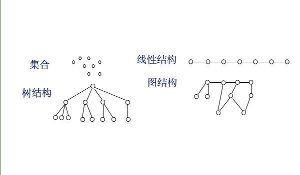
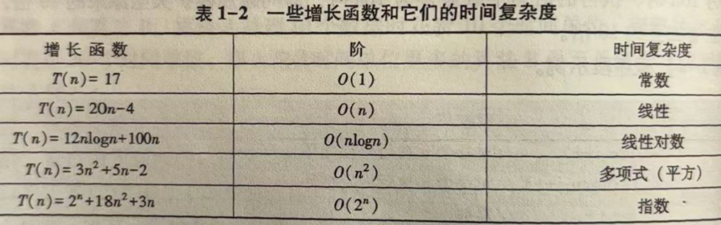
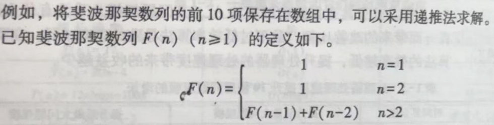
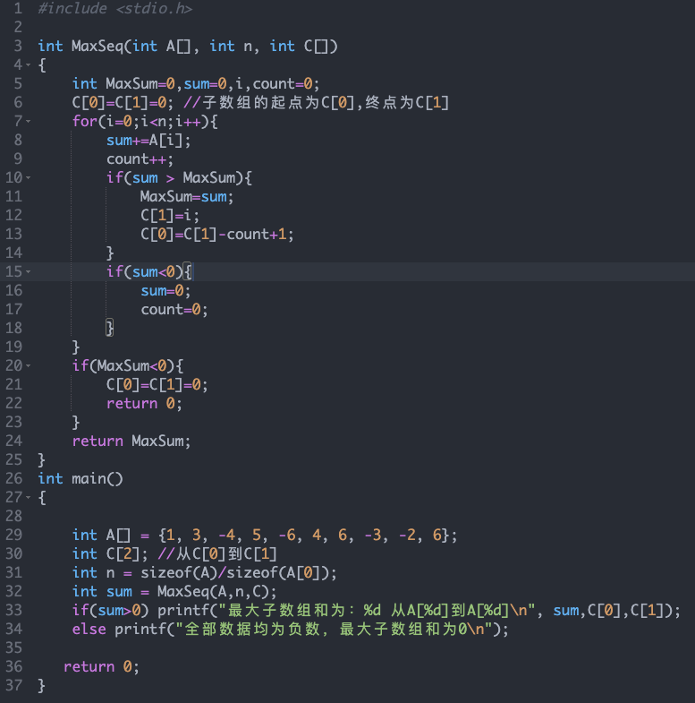

# 第一章、绪论  

目标：  

* 了解数据结构在计算机应用哪个领域中的作用  
* 掌握数据结构涉及的基本概念和术语，了解4种基本的数据结构和4种基本存储方法，理解逻辑结构与物理结构的含义及其相关关系  
* 掌握抽象数据类型的表示&描述，能使用抽象数据类型描述实际问题  
* 掌握算法的概念及其特性，能使用类C语言没描述算法  
* 掌握算法的评估和复杂性度量，对简单算法进行复杂性评估  
* 理解算法的基本设计策略特点，使用基本的算法策略实现简单程序  

## ✍️ 本章目录

- [一、第一节：基本概念和术语](#一第一节基本概念和术语)
- [二、第二节：算法和算法分析](#二第二节算法和算法分析)
- [三、第三节：算法设计策略简介](#三第三节算法设计策略简介)
- [第一章总结](#第一章总结)
- [习题](#习题)
  - [一、单项选择题](#一单项选择题)
  - [二、填空题](#二填空题)
  - [三、解答题](#三解答题)
  - [四、算法设计题](#四算法设计题)
  - [第一章·简答题](#第一章简答题)

---

## 一、第一节：基本概念和术语

20世纪80年代以后出现了抽象数据类型概念  

**数据**

对数据进行操作的定义  
但不涉及操作的具体实现  

****数据****：是指所有能输入计算机并被计算机程序处理的符号的集合  

数据是各种各样的  
复杂的数据往往由简单的数据构成  
构成数据的基本单位称为：数据元素 【数据表中一条记录】  
数据元素还可以细分为：数据项【数据表中一条记录中的一个数据字段】  

数据的最小不可分割单位是：数据项  

逻辑上相关的，具有物理意义的若干数据项构成一个数据元素  

数据元素作为一个完整的对象（整体）是构成数据的基本单位  

### 考点一 数据、数据元素和数据项  

核心：数据 》数据元素》数据项（范围）  

数据的**基本单位**是数据元素，数据元素还可以细分为数据项  

理解：  
下面的学生表格中的所有记录看作是：数据  
数据的每一条记录，也就是每一个学生的信息，每条记录看作是数据元素  
每条记录中学生的信息：学号、性别等字段列看做是数据项  


| 学号           | 姓名 | 性别 |
| ------------ | -- | -- |
| 20250212-001 | 张三 | 男  |
| 20250212-002 | 李四 | 女  |
| 20250212-003 | 王五 | 男  |


数据 (Data)  
   |  
   |--- 数据元素1 (Data Element 1)  
   |        |  
   |        |--- 数据项1.1 (Data Item 1.1)  
   |        |--- 数据项1.2 (Data Item 1.2)  
   |        |--- ... (其他数据项)  
   |  
   |--- 数据元素2 (Data Element 2)  
   |        |  
   |        |--- 数据项2.1 (Data Item 2.1)  
   |        |--- 数据项2.2 (Data Item 2.2)  
   |        |--- ... (其他数据项)  
   |  
   |--- ... (其他数据元素)  

### 考点2 数据逻辑结构  

结构：数据元素之间的相互关系构成结构，带有结构性的数据元素集合构成数据结构  


逻辑结构是指数据元素之间的逻辑关系，分为线性结构和非线性结构两大类  

数据结构分为：（研究的基本内容）  
* 逻辑结构  
* 物理结构  
  

逻辑结构：  
数据的逻辑结构从逻辑上描述数据，表名数据元素之间的关系是什么样子的，与数据的存储方式无关，独立于计算机，独立于程序设计语言  

基本的数据结构包括4类：  

* 集合：由元素构成，是数学中最基本的概念之一， 没有逻辑关系  
* 线性结构：是数据元素之间存在着先后次序关系的结构，每个元素都对应着一个唯一的次序，这个次序决定着元素的位置。一对一  
* 树结构：是一种层级结构，其中的数据元素按层排列。非线性结构（一对多）  
* 图结构：是一种网状结构，其中的每个数据元素都可以与多个其他的数据元素相关，树结构可以被看做图结构的特例。非线性结构（**多对多**）  
  

  

#### 存储结构（也称物理结构）  

数据元素及其关系在计算机内的**存储方式**  

### 考点3 常用的存储方法  

* 顺序存储方法  
    * 逻辑上相邻的数据元素，存储到物理位置相邻的存储单元中  
    * 存储空间是连续的  
* 链式存储方法  
    * 逻辑上相邻的数据元素，不要求其存储的位置也相邻的存储单元  
    * 通过**指针相连**  
* 索引存储方法  
    * 建立索引表，索引表由**索引项**组成，通过索引项可以加快查找数据元素的速度  
* 散列（哈希）存储方法  
    * 根据元素的关键字计算出该元素的物理存储位置  

### 考点4 抽象数据类型  

* 定义类型的名字  
* 定义类型上的操作  
* **不实现**类型上操作  

```c
ADT Triangle{ // 三角形的抽象数据类型定义  
	数据部分  
	a,b,c; //  表示构成三角形的三条边，实型
	操作部分
	area(a,b,c); //  给定三条边，计算三角形面积  
	 	输入：a,b,c  
		输出：三角形的面积  
		前提条件：三条边满足构成三角形的条件  
	perimeter(a,b,c); //给定三条边，计算三角形周长  
		输入：三条边  
		输出：三角形的周长  
		前提条件：三条边满足构成三角形的条件  
}  
```

下列选项中，定义抽象数据类型时不需要做的事情是（C）  

A：给出类型的名字  
B：定义类型上的操作  
C：实现类型上的操作  
D：用某种语言描述抽象数据类型  

## 二、第二节：算法和算法分析

### 考点5 算法的特性

1. 输入：有0个或多个输入值  
2. 输出：有1个或多个输出值  
3. 有穷性：一个算法必须在执行有穷步骤之后结束  
4. 确定性：算法的每一个步骤都必须有确切的含义  
5. 可行性：算法中要做的运算都是相当基本的、能够精确进行的  

助记：****出入有确****（喜鹊）****行****（同行）  

例题：简述算法的五个特性（2024-10）  

例题：算法必须满足的五个准则是：输入、输出、++有穷性++、确定性 和 ++可行性++  

例题：一个算法必须在执行有穷步骤后结束，这个特性是算法的：++有穷性++  

### 考点6 算法的复杂度  

#### 时间复杂度：执行算法所耗费的时间  

————-----——由 简 到 难————————————》  
O(1)、O(logn)、O(n)、O(nlogn)、O(n²)、O(n³)、O(2ⁿ)、O(nꜝ)  

  

#### 空间复杂度：执行算法所耗费的存储空间

例题：  

int fact(int n)  
{  
    int factv = 1, i;  
    if (n < 0) return -1;  
    if (n <= 1) return 1;  
    for (i = 2; i <= n; i++)  
        factv = factv * i;  
    return factv;  
}  

函数的时间复杂度是（B）  

A、O(log₂n)  
B、O(n)  
C、O(nlog₂n)  
D、O(n²)  

分析：fact函数是计算整数n的阶乘，赋初值及返回语句 执行 4次，for执行n-1次  
所以增长函数T（n） = 4 + n - 1 ‎ =  n+3，时间复杂度为O（n） 即线性的，故选择B  

例题：  

int x=m;  
while(x>1){  
	x = x/2;  
}  
其中m>1，则时间复杂度为（A）  

A、O(logm)  
B、O(m²)  
C、O(m¹ᐟ²)  
D、O(m¹ᐟ³)  

分析：每次执行“x=x/2”,都会使x值减半，时间复杂度根A相近，故选A  

例题：算法的空间复杂度表示的是（D）  

A、算法的可读性  
B、算法的难易程度  
C、执行算法所耗费的时间  
D、执行算法所耗费的空间  


## 三、第三节：算法设计策略简介

### 考点7 算法设计策略简介【新增内容】  

* 递推法：是根据已知条件逐步推出后续结果；（经典算法：斐波那契数列）  
* 迭代法：是通过不断重复更新变量来逼近解；（经典算法：求最大公约数）  
* 递归法：是函数自己调用自己来解决问题；（经典算法：求阶层的递归实现）  
* 贪心法：是在每一步选择中都采用当前状态下的最优决策；（经典算法：构造哈夫曼树 和 求最小生成树）  
* 分治法：是将问题分解为子问题分别解决后合并；（经典算法：快速排序 和 归并排序）  
* 动态规划法：是把多阶段决策问题进行分解，通过记录中间状态来求解最优解。（经典算法：最大子序列和）  
  

递推法：是根据已知条件逐步退出后续结果  

  

分析：  

由递推公式可计算出数列的第三项：F(3) = F(2)+F(1) ，为2  
再由第二项和第三项，得到第四项：F(4) = F(3)+F(2)，为3  
再由第三项和第四项，得到第五项：F(5) = F(4)+F(3)，为5  
以此类推…  
得到数列的前10项为：1、1、2、3、5、8、13、21、34、55  

例题：在设计求斐波那契数列前n项的算法时，适宜使用的算法策略是（B）  

A：分治法  
B：递推法  
C：递归法  
D：穷举法  

## 第一章总结

### 真题【2024年10月】  

1、下列任何两个结点之间都没有逻辑关系的是（C）（2分）  
A：图形结构 B：线性结构 C：集合 D：树形结构  

2、下列选项中，定义抽象数据类型时**不需要**做的事情是（2分）  

A：给出类型的名字  
B：定义类型上的操作  
C：实现类型上的操作  
D：用某种语言描述抽象数据类型  

### 第一章 习题 单选题第7题P48  

16、在数据结构中，线性结构 是数据元素之间存在着**先后次序关系**的结构。（2分）  

### 真题【2024年10月】  

27，简述算法的五个特性。（5分）  

输入性；有0个或多个输入值  
输出性：有1个或多个输出值  
有穷性：一个算法必须在执行有穷步骤之后结束  
确定性：算法的每一个步骤都必须有确切的含义  
可行性：算法中要做的运算都是相当基本的、能够精确进行的  

助记词：**出入有确（喜鹊）行（同行）**  

总结：第一章占比11%，平均每章占比12.5%  

## 习题

### 一、单项选择题
1、在数据结构与算法中，从逻辑上可以吧数据结构分为（B）  

A：紧凑结构和非紧凑结构  
B：线性结构和非线性结构  
C：内部结构和外部结构  
D：动态结构和静态结构  

2、数据元素可以细分为（A）  

A：数据项  
B：字符  
C：二进制位  
D：数据记录  

3、树结构中元素之间是（B）关系  

A：一对一的  
B：一对多的  
C：多对多的  
D：不确定的  

4、在数据结构中，数据元素之间均为一对一关系，称为（A）  

A：线性结构		B：树结构  
C：图结构			D：集合结构  

5、下列选项中，不属于数据结构常用存储方式的是（C）  

A：顺序存储方式		B：链式存储方式  
C：分布存储方式		D：散列存储方式  

6、算法分析要评估的两个主要方面是（B）  

A：正确性和简明性		B：时间复杂度和空间复杂度  
C：可读性和可维护性	D：数据复杂性和程序复杂性  

7、下列选项中，定义抽象数据类型时不需要做的事情是（C）  

A：给出类型的名字		B：定义类型上的操作  
C：实现类型上的操作	D：用某种语言描述抽象数据类型  

8、下列算法的时间复杂度中，算法效率最低的是（C）  

A：O(n)  
B：O(n²)  
C：O(2ⁿ)  
D：O(logn)  

9、设n是描述问题规模的非负整数，则下面程序片段的时间复杂度是（A）  
x=2;  
while(x<n/2){  
    x = 2 * x;  
}  
A: O(log₂n)  
B: O(n)  
C: O(nlog₂n)  
D: O(n²)  

10、设n是描述问题规模的非负整数，则下面程序片段的时间复杂度是（A）  

x=1;  
while(n>=(x+1)*(x+1)){  
	x=x+1  
}  

A: O(n¹ᐟ²)  
B: O(log₂n)  
C: O(n)  
D: O(nlog₂n)  

11、在设计求斐波那契数列前n项的算法时，适宜使用的算法策略是（B）  

A: 分治法  
B: 递推法  
C: 递归法  
D: 穷举法  

### 二、填空题

1、在数据结构与算法中，将所有能输入计算机并被计算机程序处理的符号集合成为：++数据++  

2、构成数据的基本单位是：++数据元素++。  

3、数据元素及其关系在计算机内的存储方式称为数据的++存储结构++。  

4、数据结构包括4类，分别是集合、线性结构、树结构和  ++==图结构==++ 。  

5、构成索引表的基本内容是 ++==索引项==++  

6、一个算法必须在执行有穷步之后结束，这个特性是算法的 ++==有穷性==++。  

7、设A={1,3,-4,5,-6,4,6,-3,-2,6}，调用函数MaxSeq(A,n,C)后，C[1]的值是___==9==__  

分析：函数MaxSeq是求数组A的最大子数组，结果是{4,6,-3,-2,6}，C[1]中保存的这个子数组最后一个元素在A中的下标，得到9。  


  

  

### 三、解答题

1、计算机能处理那些数据？举例说明  

计算机能处理的数据多种多样，大到可以是一幅地图、一本一部电影，小到可以使一个字符，甚至是计算机中的一位，可以使数值型的数据，也可以是非数值型的数据，既可以是简单结构的，也可以是复杂结构的。  

2、如何理解线性结构中元素之间是一对一的关系？  

在线性结构中，除了表头元素和表尾元素外，每个元素有唯一的直接前驱和唯一的直接后继，所以对于每个元素而言，当有直接后继时，它与其直接后继形成一对一的关系。  

3、定义代表交通工具的抽象数据类型vehicle，并添加必要的数据和操作。  

对于vehicle，可以定义表示其基本属性的数据，包括品牌brand、颜色color、价格price等，相应的操作可以是设置最大速度setSpeed(int speed)，设置自重setWeight(int weight）等  

ADT vehicle{ //交通工具的抽象数据类型定义  
	数据部分：  
		brand：//品牌，字符串  
		color：//颜色，字符串  
		price：//价格，实型  
		speed：//速度，实型  
		weight：//载重，实型，单位吨  
	操作部分：  
		setSpeed（speed）：//设置速度  
			输入：speed  
			输出：设置是否成功  
			前提条件：speed不能超过限制条件  
		setWeight（weight）：//设置载重  
			输入：weight  
			输出：设置是否成功  
			前提条件：weight值不能超过限制  
}  

4、定义表示复数的抽象数据类型。  

ADT complex{ // 复数的抽象数据类型定义  
	数据部分：  
		real：//实部，实型  
		imaginary：//虚部，实型  
	操作部分：  
		add(complex1,complex2)：//加法  
			输入：两个复数  
			输出：两个复数的和  
			前提条件：两个复数正确无误  
		sub(complex1,complex2)： //减法  
			输入：两个复数  
			输出：它们的差  
			前提条件：两个复数正确  
}  


5、为什么不使用算法的绝对运行时间来衡量算法的时间效率？  

同一个算法处理不同数量的数据时，所花费的绝对运行时间可能不同，同一个算法处理相同数量的数据时，在不同配置的电脑上的绝对运行时间也可能不同，所以使用算法的绝对运行时间不能有效衡量算法的时间效率  

6、在评估算法的空间效率时，需要考虑那些占用的存储空间？  

算法运行过程中，临时占用的空间大小是要考虑的存储空间，算法代码占用的空间、算法中初始数据占用的存储空间不考虑在内  

### 四、算法设计题


1、设计一个算法，使用最少的比较次数找出三个不同整数a、b、c的中值。  

```java
int middle(int a,int b,int c) {
    if (a > b) {
        if (b > c) return b;    //a>b>c
        else if (a > c) return c;    //a>c>b
        else return a;    //c>b>a
    } else {
        if (a > c) return a;    //b>a>c
        else if (b > c) return c;    //b>c>a
        else return b;    //c>b>a
    }
}
```

2、设计一个算法，对于给定的正整数n，列出斐波那契数列的前n项，要求该算法的空间复杂度为O(1)。  

斐波那契数列的前两项均为1，从第三项开始，每一项都是其前两项之和。
使用整型变量f1、f2和f3表示数列中相邻三项的值，初始时，f1和f2的值均为1。然后计算新的项f3=f1+f2，计算后用f2的值更新f1，用f3的值更新f2。
```java
void fibonacci(int n)
{
	int f1=1,f2=1,f3,i;
	if(n<=0){
		printf("n值错误\n"); 
		return;
	}
	else if(n==1){
		printf("1\n");
		return;
	}
	else{
		printf("1 1 ");
		for(i=3;i<=n;i++){
			f3=f1+f2;
			printf("%d ",f3);
			f1=f2;
			f2=f3;
		}
		printf("\n");
	}
}
```

### 第一章·简答题

1、简述数据、数据元素、数据项的区别  

	将所有能输入计算机并被计算机程序处理的符号集合 称为 数据，  
	数据元素是构成数据的基本单位  
	数据元素可以细分为数据项，数据项是数据元素的组成部分，是数据的最小不可分割单位  

2、简述逻辑结构与存储结构的区别与联系  

	逻辑结构指的是：数据元素之间的逻辑关系，不涉及到实际存储方式。关注**元素间关系**，不关心“内存如何放置”。  
	存储结构指的是：数据元素及其关系在计算机内的存储方式，也就是逻辑结构在****计算机内存中的实际存放方式。****关注**元素在内存中的具体布局**，实现逻辑结构。  
	联系：存储结构需实现逻辑结构的操作，存储结构是逻辑结构在计算机中的****物理实现。****好的存储结构可以提高操作效率  

1. **逻辑结构**：描述数据元素之间的逻辑关系。
2. **存储结构**：逻辑结构在计算机中的实际实现方式。
3. **对应关系**：  
**线性结构** → 顺序存储（数组）或链式存储（链表）  
**树形结构** → 顺序或链式存储  
**图结构** → 邻接矩阵或邻接表


3、简述数据结构包括哪几类，分别是什么  

	集合：有元素构成，是数学中最基本的概念之一  
	线性结构：是数据元素之间存在着==先后次序关系==的结构，每个元素对应着一个唯一的次序，这个次序决定着元素的位置  
	树结构：是一种==层级结构==，其中的数据元素==按层排列==  
	图结构：是一种==网状结构==，其中的每个数据元素都可以与多个其他的数据元素相关。树结构可以被看作图的==特例==。  

4、简述常用的存储方法  

	顺序存储方法：逻辑上相邻的数据元素，存储到物理位置相邻的存储单元中。==存储位置必须相邻==  
	链式存储方法：逻辑上相邻的数据元素，不要求其存储的位置也相邻的存储单元。存储位置不一定相邻  
	索引存储方法：建立==索引表==，索引表由==索引项==组成，通过索引项可以加快查找数据元素的速度  
	散列（哈希）存储方法：根据元素的关键字计算出该元素的物理存储位置

5、简述算法的五个特性  

* 	输入性：有0个或多个输入值  
* 	输出性：有1个或多个输出值  
* 	有穷性：一个算法必须在执行有穷步骤之后结束  
* 	确定性：算法的每一个步骤都必须有确切的含义  
* 	可行性：算法中要做的运算都是==相当基本的==、能够==精确进行的==  

6、简述时间复杂度和空间复杂度的概念，以及大O表示法的含义  

	时间复杂度：是指执行算法所耗费的时间  
	空间复杂度：是指执行算法所耗费的空间  
	  
	大O表示法描述算法执行时间随着==输入规模增长的趋势==，如O（n）表示线性增长  

7、简述算法设计策略  

	递推法：根据==已知条件==逐步推出后续结果。  
	迭代法：是通过==不断重复更新变量==来逼近解  
	递归法：是函数==自己调用自己==来解决问题  
	贪心法：是在每一步选择中都采取当前状态下的==最优决策==  
	分治法：是将问题分解为==子问题分别解决后合并==  
	动态规划法：是把多阶段决策问题进行分解，通过记录中间状态来求解最优解  

8、简述什么是抽象数据类型（ADT）？举例说明

	ADT 是数据类型的抽象定义，包括数据对象、数据关系及一组操作。
	例如“三角形”ADT 包括三条边和计算面积、周长的操作


  

