# 第二章、线性表  
  
## 考点【==新增内容==】  
  
* 空间存储效率  
    * 备注：顺序表和链表  
* 空闲单元链表  
* 静态链表  
    * 备注：2024年10月第18题  
  
## 第一节 线性表的定义和基本操作  
  
## 考点1 线性表  
  
是一种线性结构，L=(a₀,a₁,…,aₙ₋₁)，这里aᵢ(0<=i<=n-1)即是线性表中的数据元素，也称为表项。  
  
第一个数据元素a₀，称为表头元素或开始元素  
最后一个数据元素aₙ₋₁，称为表尾元素或终端元素  
  
a₀ 是 a₁ 的直接前驱， a₁ 是 a₀ 的直接后继  
  
线性表有3个特点：分别是：【**解答题**】  
  
* 各元素属于==同一个类型==  
* 元素个数是==有限的==  
* 各元素之间不一定有大小关系，但一定==有次序关系==  
  
**线性表**可以使用 顺序存储方式和链式存储方式 保存线性表  
  
顺序存储方式—》顺序存储结构，使用==数组==保存线性表中的各元素，相应的线性表为顺序表  
链式存储方式—》链式存储结构，使用==链表==保存线性表中的各元素，相应的线性表为链表  
  
## 第二节 线性表的顺序存储及实现  
  
## 考点2 顺序表 - 存储地址  
  
使用顺序存储结构保存的线性表称为：**顺序表**  
  
使用==数组==保存各元素，==数组==是内存中一片连续的空间，相邻的两个单元在内存中的实际地址也是相邻的，  
即：数组中相邻单元的存储地址相邻  
  
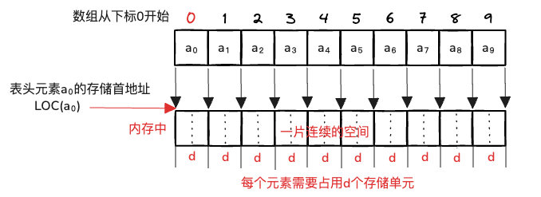  
  
数组A占据内存中从位置M开始的一片连续空间，其中，第1个字节和第2个字节用来保存元素a₀  
依次类推，线性表L共占用12个字节。  
  
==通常每个字节对应内存中的一个存储单元==。  
  
设LOC(aᵢ)(i>=0) 表示的存储首地址，每个元素需要占用d个存储单元  
备注：数组从下标0开始，即：第一个元素是a₀  
  
* 已知直接前驱：LOC(aᵢ) = LOC(aᵢ₋₁) + d   直接前驱的地址 + 每个元素占用的存储单元  
* 已知首元素：LOC(aᵢ) = LOC(a₀) + i × d 首元素地址 + i ×  每个元素占用的存储单元  
* 已知前面某个元素：LOC(aᵢ) = LOC(aⱼ) + (i-j) ✖️d  【j < I】   
  
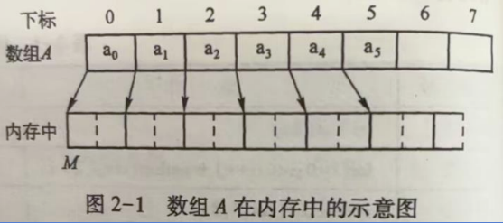  
  
  
例题：  
  
1、设顺序表首元素的存储地址是4000，每个数据元素占8个存储单元，则第11个元素的存储地址是____?  
  
解析：  
  
根据计算公式：LOC(aᵢ) = LOC(a₀) + i × d  
第11元素的下表是10，即a₁₀， 求a₁₀的存储地址即可  
LOC(a₁₀) = LOC(a₀) + 10 × d  
LOC(a₁₀) = 4000 + 10 × 8   
LOC(a₁₀) = 4080  
  
2、一个顺序表中第5个元素的地址是206，第7各元素的地址是210，name第1个元素的地址是____?  
  
A：196  
B：198  
C：200  
D：201  
  
解析：  
  
第5个元素的地址是206，数组下表从0开始，即LOC(a₄) = 206  
第7个元素的地址是210，数组下表从0开始，即LOC(a₆) = 210  
LOC(a₆) = LOC(a₄) + (6-4) ✖️d  
210 = 206 + 2×d  
4 = 2d  
d = 2  
  
LOC(a₄) = LOC(a₀) + 4 × d = 206  
LOC(a₄) = LOC(a₀) + 4 × 2 = 206  
LOC(a₄) = LOC(a₀) + 8 = 206  
LOC(a₀) = 198  
  
  
## 考点3 顺序表 - 基本操作的实现  
  
使用顺序存储结构保存的线性表称为顺序表  
  
备注：==数组从下标0开始==  
  
两种常见的操作：插入 和 删除，核心：移动元素  
  
例题：一个顺序表，初始时有5个元素，11、5、23、19和6。在位置2插入元素27，然后删除位置3的元素，==备注：从下标0开始==  
  
位置2就是下标为2的地方  
  
先插入、后删除的操作如下示意图  
  
1、依次将元素6、19、23向后移动一个位置，把位置2空出来，将元素27保存在这个位置上  
2、位置3的元素是23，删除后，需要将23后面的元素19、6依次前移一个位置  
  
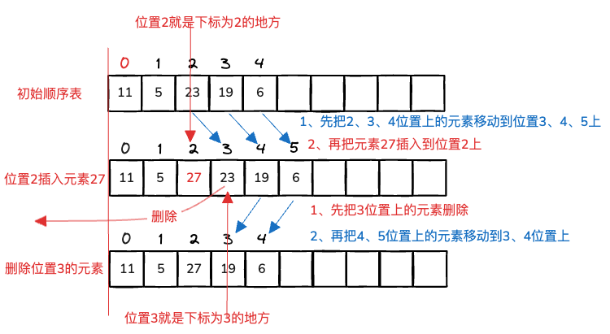  
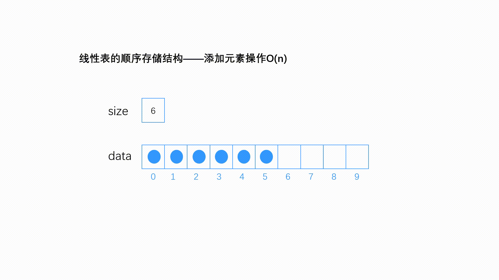  
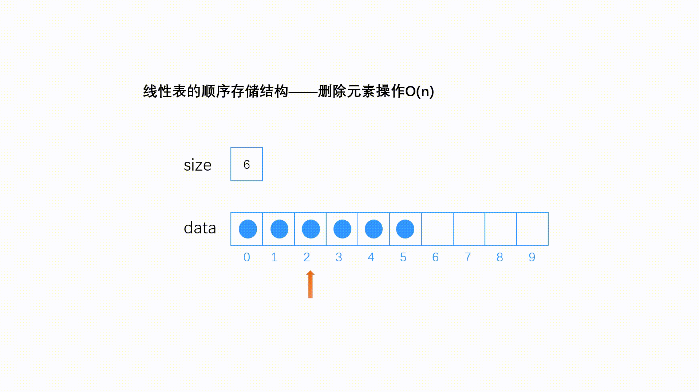  
插入时：先后移，然后插入  
  
删除时：先删除，然后前移  
  
例题：  
  
两个元素（aᵢ和aⱼ）之间的元素个数：下标相减+1，即：**j-1+1  包含这两个相减的元素**  
  
18、若在长度为n的顺序表中删除第i个元素（1<=i<=n），则需要向前移动的元素个数是__**==n-i==**___?  
  
解析：删除第i个元素，则第i个元素的下表为i-1，需要向前移动（下标为i 的元素 以及后续的元素），  
L=(a₀, a₁, …, aᵢ₋₁, aᵢ, aᵢ₊₁, …, aₙ₋₁)  
移动个数：n-1   下标相减+1   = n-1-i+1  
  
在长度为n的顺序表的第i个位置插入一个元素，元素的移动次数为__**==n-i+1==**_?  
  
解析：  
  
L=(a₀, a₁, …, aᵢ₋₁, aᵢ, aᵢ₊₁, …, aₙ₋₁)  
  
第i个位置插入一个元素，要移动aᵢ₋₁ 及后续的元素，移动个数： n-1-i+1+1 ‎ =  n-i+1  
  
相比删除，要多移动一个元素（插入位置上的元素）  
  
  
## 第三节 线性表的链式存储及实现  
  
## 考点4 单链表 - 存储结构  
  
使用链式存储结构保存的线性表称为****链表****  
  
使用链表保存各元素，在内存中的空间，可以连续也可以不连续  
  
注意：后续我们主要讲带head（头结点）的单链表，head也叫虚拟结点  
  
例题：若线性表采用链式存储结构保存，则要求内存中可用存储单元的地址（D）  
  
A：必须是连续的  
B：部分地址必须是连续的  
C：一定是不连续的  
D：连续或不连续都可以  
  
**单链表**是由一组动态分配的结点形成的链表  
  
结点结构：  
  
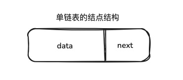  
  
**在带头结点的单链表中，表为空的判定条件是**：head->next == null  
  
typedef int ELEMType;  
// 定义单链表节点结构体  
typedef struct node {  
	ELEMType data; // 数据域  
	struct node *next; // 指针域  
} ListNode;  
  
  

| 数据域（data）     | 指针域（next）                            |
| ------------- | ------------------------------------ |
| 存储具体的数据值，例如：5 | 指针，指向链表中的下一个节点（用箭头表示，箭头方向指向后续结点所在方向） |
  
  
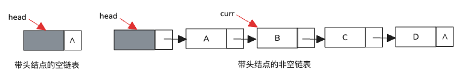  
  
例题：  
  
3、带头结点的单链表L的头指针是head，结点结构为：data next，若要求当L不为空时判定条件为真，则正确的表达式是（A）  
  
A：head->next != null  
B：head->next == null  
C：head != head  
D：head == null  
  
## 考点5 单链表 - 基本操作的实现  
  
注意：后续我们主要讲带head（头结点）的单链表，head也叫虚拟节点  
  
两种常见的操作：插入 和 删除，==核心==：指针指向  
  
**1、插入**：  
  
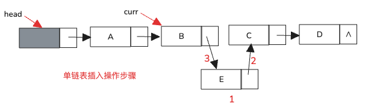  
  
步骤如下：前提：插入附近有单指针  
  
1. 创建新结点并在其中保存了值E，假设指针为e  
2. 先操作后边结点指针：e->next = curr->next  
3. 再操作前边结点指针：curr->next = e  
  
****助记词****：先后再前  
  
==原因：这样能防止链表断裂，确保数据完整性==  
举例：若顺序相反，先前再后，先将B的指针指向E，即curr->next = e，则会丢失C以及后续节点的引用，导致链表断裂。  
  
例题：在单链表L中，已知q所指结点是p所指结点的前驱结点，next是结点的指针域，若在q和p之间插入s所指结点，则执行的操作是（D）  
  
A：s->next=p->next;p->next=s  
B：p->next=s->next;s->next=p  
C：p->next=s;s->next=q  
D：q->next=s;s->next=p;  
  
解析：  
  
因为插入位置附近的两个结点q、p都有独立的指针指向，所以之前说的（先操作后边结点指针，再操作前边结点指针）的修改顺序就可以互换了。修改次序可以使任意的，先修改前边、或修改后边都是不可以的。  
  
**2、删除**  
  
步骤如下：  
  
1. 使用一个临时指针temp指向即将被删除的结点  
2. 修改当前指针curr所指结点的指针域让其指向temp指向结点的后继结点 curr->next=temp->next  
3. 释放临时指针temp空间  
  
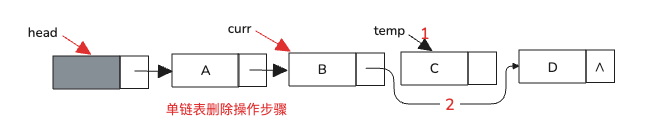  
  
例题:  
  
1、在带头结点的单链表中，若删除指针p所指结点的后继结点，则执行的操作是（A）  
  
A：p->next = p->next->next;	B：p=p->next;p->next=p->next->next;  
C：p->next=p->next;			D：p=p->next->next;  
  
2、若L是带头结点的单链表，则删除第一个数据元素节点所应执行的操作是（C）  
  
A：L=L->next;					B：L->next=L;  
C：L->next = L->next->next;	D：L=L->next->next;  
  
3、线性表的两个元素，如果逻辑上相邻，则（C）  
  
A：顺序存储和链式存储时都一定相邻  
B：顺序存储和链式存储时都一定不相邻  
C：顺序存储时一定相邻，链式存储时不一定相邻  
D：顺序存储时不一定相邻，链式存储时一定相邻  
  
4、在头指针为head的单链表中，判断指针变量p指向终端结点的条件是（D）  
  
A：p->next->next==head  
B：p->next==head  
C：p->next->next == NULL  
D：p->next == NULL  
  
## 考点6 单向循环链表  
  
在**单链表**的基础上，**最后一个结点**的**指针指向头结点**，形成一个环形结构。  
  
**在单向循环链表中，表为空的判定条件是**：**head->next == head**  
  
**有head（头指针）和rear（尾指针）**  
  
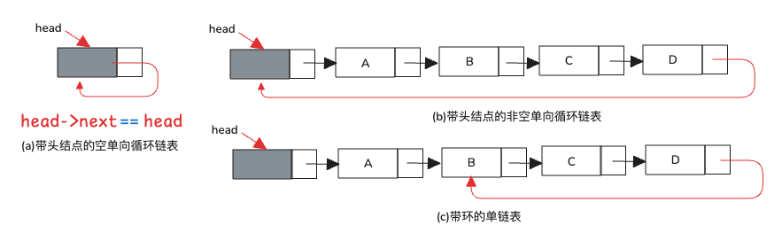  
  
例题：设带头结点的单向循环链表L中仅含有一个数据结点，head是L的头指针。现要在该数据结点之后添加一个新结点，指针p指向该新结点，给出相应的语句序列。  
  
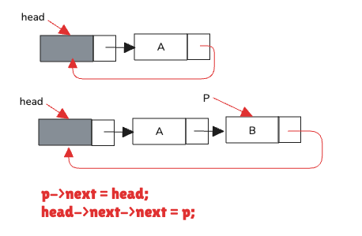  
根据题意，插入的新结点是L的终端结点，它的next域应该指向头结点，然后让L中现有的唯一数据结点的next域指向该结点。  
  
即：head->next 就是单向循环链表L中的唯一数据结点。  
  
语句序列如下：  
**p->next = head;**  
**head->next->next = p;**  
  
17，指针head指向带头结点的非空单循环链表L，现在若删除L的开始结点，则正确的操作语句是？  
  
head->next = head->next->next;  
  
18，非空的带头结点的单循环链表中，终端结点的指针域指向的是链表的？  
  
头结点  
  
## 考点7 双向链表和双向循环链表  
  
  
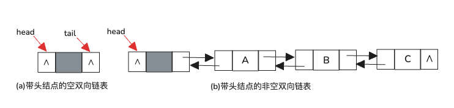  
  
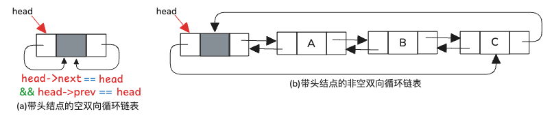  
  
例题：  
  
1、在双向循环链表中，将指针s指向的结点插入到指针p所指的结点（非尾结点）之后，下列选项中，正确的指针修改语句序列是（D）  
  
A：p->next = s;s->prev = p;p->next->prev=s;s->next=p->next;  
B：p->next->prev = s;p->next=s;s->prev=p;s->next = p->next;  
C：s->prev = p;s->next=p->next;p->next = s;p->next->prev = s;  
D：s->prev = p;s->next = p->next;p->next->prev = s;p->next = s  
  
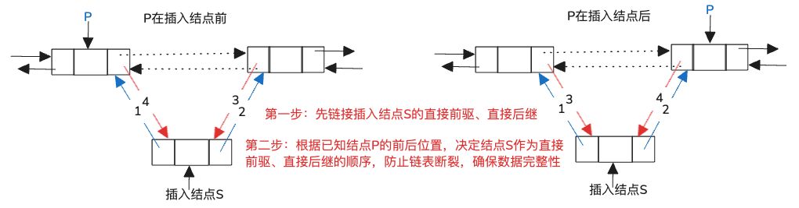  
2、头指针head指向带头结点的双向循环链表L，判断L为空的条件是（D）  
  
A：head->pre == next  
B：head->next == pre  
C：head->next == NULL  
D：head->pre == head && head->next == head  
  
  
  
## 考点8：顺序表和链表—优缺点  
  
### 顺序表  
  
* 可以随机访问，时间复杂度**O(1)**  
* 查询速度快  
* 插入和删除操作不方便，速度慢（可能需要****移动大量元素****）  
  
**链表**  
  
* 不能随机访问，时间复杂度O(n)  
* 查询速度慢  
* 插入和删除操作方便，速度快（只需****改变指针****）  
  
例题：  
  
1、线性表采用顺序存储时的优点是（D）  
  
A：插入运算方便  
B：删除运算方便  
C：存储空间不必连续  
D：可随机访问各元素  
  
2、对需要频繁插入和删除元素的线性表，适合的存储方式是（B）  
  
A：顺序存储  
B：链式存储  
C：索引存储  
D：散列存储  
  
  
  
## 考点9：顺序表和链表—空间存储效率【新增内容】  
  
设n表示线性表中当前元素的个数  
D表示最多可以在数组中存储的元素个数，也就是数组的大小  
P表示指针的存储单元大小  
E表示数据元素的存储单元大小  
  
核心：**顺序表**只包含数据元素，**单链表**包含数据元素和指针  
  
n：表示线性表中当前元素的个数  
D：表示最多可以在数组中存储的元素个数，也就是数组的大小  
P：表示指针的存储单元大小  
E：表示数据元素的存储单元大小  
  
顺序表的空间需求：D × E  
单链表的空间需求：n × (P + E)  
  
令：D × E = n × (P + E)，求出n的临界值：D × E / (P + E)  
  
顺序表的空间效率高（>临界值）  
单链表的空间效率高（<临界值）  
  
  
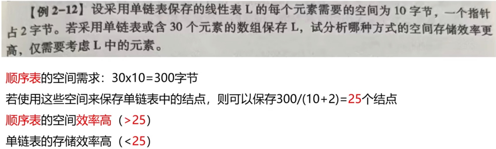  
  
## 考点10 - 空闲单元链表【新增内容】  
  
在链表中：  
  
插入一个结点时，需要调用malloc函数分配空间  
删除一个结点时，需要调用free函数释放空间  
  
**频繁**调用这些函数的时间开销就会很大  
  
这时就引出了：**空闲单元链表**  
  
以链表的形式组织内存中未使用的空闲单元，便于高效管理内存分配与回收  
  
**作用**：暂时保管要归还给系统的结点空间  
  
当删除一个结点时，不在调用free函数释放空间，而是把这个结点插入到**空闲单元链表**中。  
当需要申请新的结点空间时，先查看**空闲单元链表**，若有直接用，若没有再调用malloc函数分配空间  
  
例题：暂时保管要归还给系统的结点空间的链表是：（****空闲单元链表****）。  
  
就是空闲单元 先不归还给系统，而是由：空闲单元链表  来统一的组织和管理保管，  
删除结点时，先不释放空间（归还给系统）而是把要删除的结点直接插入到“空闲单元链表”，  
插入结点时，先不分配空间（向系统申请空间malloc），而是先去查看“空闲单元链表”是否有，有则直接用；没有“空闲单元链表”再去向系统申请malloc空间  
  
## 考点11—静态链表【新增内容】  
  
用一维数组实现的链表，兼具顺序表和链表 的优点，解决链表动态分配空间不便问题。  
  
假设静态链表保存在一维数组A中，每个元素的类型与单链表结点类型一致，也有数据域data和指针域next  
  
就是有数据域 和 指针域 的顺序表  
  
将**A[0] **作为一个特殊结点，类似于单链表中的表头结点，  
在数据域data中保存链表中元素的个数  
在指针域next中保存静态链表中第一个元素在数组中的下标  
  
  
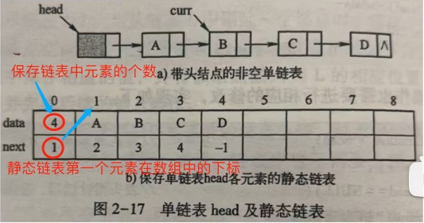  
  
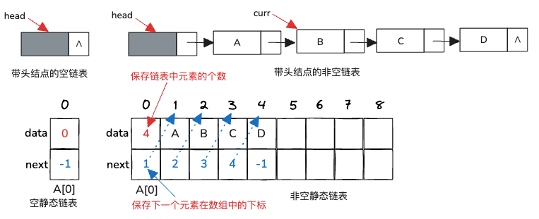  
  
初始时，data的值是0，next的值是-1  
  
例题：【2024-10】  
  
在**数组**中保存的**链表**称为：静态链表。  
  
## 考点12—静态链表：插入和删除操作【新增内容】  
  
插入：  
  
新元素E插入到B和C之间的操作步骤  
  
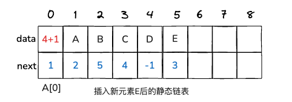  
  
① 调用mallo函数创建新结点空间  
② E—>C 下标5处的新元素E的next域 设置为 元素C的数组下标3  
③ B<—E 下标2处的元素B的next域 设置为 新元素E的数组下标5  
④ 将链表中的元素个数加＋1，A[0]的data 设置为5  
  
删除：  
  
删除D元素，是表尾元素  
  
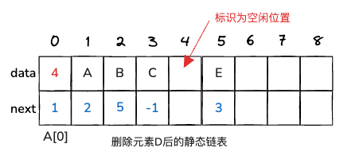  
  
① 元素D的前驱（元素C）的next域 设置为 -1，表示静态链表的结束，元素C成为新的表尾元素  
② 在静态链表中将这个位置标识为空闲位置，相当于在单链表中进行删除操作时调用delete函数  
③ 将链表中的元素个数减－1，A[0]的data 设置为4  
  
  
## 考点13—静态链表：空闲单元【新增内容】  
  
数组中未曾使用过的单元必定是一片连续单元，可以使用整型变量unused记录这片连续单元的首位置，凡是下标大于等于unused 且 不越界的单元，均为**空闲单元**  
  
例如：下图中，unused的值为6，下标大于等于6且小于9的单元即这类空闲单元，对应下标为6、7、8三块空间  
  
对于数组中曾经使用过且目前空闲的所有单元，建立另一个**静态链表**将其链接起来，可以将这个链表称为**空闲单元链表**，  
用整型变量available 记录这个链表**首节点**的**下标**。  
  
例如：下图中，available的值为4因为目前只有这一个空闲位置，故它也是表尾，所以位置4的next值为-1。对应下标4这一块空间  
  
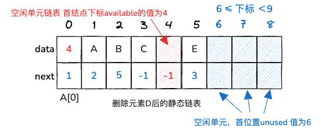  
  
## 考点14—单链表的使用【新增内容】  
  
1. 查找单链表倒数第k个结点  
2. 查找单链表的中间结点  
3. 将单链表逆置  
4. 验证本章给出的单链表的实现  
  
【了解即可】  
  
## 第二章总结  
  
真题 2024年10月  
  
3、在单链表L中，已知q所指结点是p所指结点的前驱结点，next是结点的指针域，若在q和p之间插入s所指结点，则执行的操作是（）  
  
A：s->next=p->next;p->next=s;  
B：p->next = s->next;s->next=p;  
C：p->next = s;s->next = q;  
D：q->next = s;s->next = p;  
  
9、带头结点的单链表的头指针为head，表为空的判定条件是  
  
A：head == NULL		B：head->next == NULL  
C：head != NULL		D：head->next == head  
  
17、设顺序表的每个元素占8个存储单元。若第1个元素的存储首地址为100，则第6非元素占用的最后一个存储单元的地址是___  
  
147  
  
第 6 个元素的存储首地址是 **140**  
每个元素占8个存储单元，因此第6个元素的存储单元地址范围为140至147（包括140和147）。最后一个存储单元的地址为147。  
  
18、在数组中保存的链表称为：静态链表  
  
30、程序的功能是返回指针curr指向结点的位置，请在空白处填上适当内容以将算法补充完整。  
  
Position func(LinkList *head,LinkNode *curr)  
{  
	LinkNode *temp=*head;  
	int count=0;  
	if(*head == NULL ||  curr == NULL)  
	{  
		printf(“指针无效\n”);  
		return  ERROR;  
	}  
	while(temp != curr && temp != NULL)  
	{  
		temp = temp->next;  
		count++;  
	}  
	return count;  
}  
  
31、已知线性表的存储结构为顺序表，阅读下列算法，并回答问题：  
  
void func(SeqList *L)  
{  
	int i,j;  
	for(i=j=0;i<L->length;i++)  
	{  
		if(L->data[i] >= 0)  
		{  
			if(i!=j)  
			{  
				L->data[j]=L->data[I];  
			}  
			j++;  
		}  
	}  
	L->length = j;  
}  
  
（1）设线性表L=（19,-6,-9,26,0,-21,74,35,-30），写出执行func(&L)后的L的状态  
  
L=(19,26,0,74,35)  
  
（2）简述算法func的功能  
  
从顺序表中**删除所有小于 0 的元素**，  
保留所有 **非负元素**，且保持其原有相对顺序不变。更新顺序表的长度。  
  
总结：第二章占比18%，平均每章占比12.5% 非常重要  
  
## 习题  
  
一、单项选择题  
  
1、下列选项中，不属于链表特点的是（B）  
  
A：插入、删除时不需要移动元素  
B：可随机访问任一元素  
C：不必事先估计存储空间  
D：所需空间与元素个数成正比  
  
2、下列关于线性表的叙述中，错误的是（B）  
  
A：线性表采用链式存储方式，便于进行插入和删除操作  
B：线性表采用顺序存储方式，便于进行插入和删除操作  
C：线性表采用链式存储方式，不必占用一片连续的存储单元  
D：线性表采用顺序存储方式，必须占用一片连续的存储单元  
  
3、若一个线性表分别采用下列存储结构进行存储，则读取一个指定位置（序号）的元素所花费时间最少得是（A）  
  
A：顺序表  
B：单向链表  
C：双向链表  
D：循环链表  
  
4、下列关于线性表的叙述中，错误的是（D）  
  
A：除第一个元素以外，均有唯一的前驱  
B：除最后一个元素以外，均有唯一的后继  
C：元素的个数可以是0，此时表为空表  
D：若元素的个数为无穷，则表为无穷表  
  
线性表元素个数是有限的、有穷的  
  
5、下列关于线性表L的叙述中，正确的是（C）  
  
A：L是由n个相同元素组成的离散数据序列  
B：L中任意一个元素有且仅有唯一直接前驱  
C：可以在L中进行取元素、查找或排序等操作  
D：不能在L的任意位置插入或删除一个元素  
  
6、若线性表L的常用操作有访问任一位置的元素和在最后进行插入和删除操作，为使操作的时间复杂度好，则下列选项中，为L选择的存储结构为（A）  
  
A：顺序表						B：双向链表  
C：带头结点的双向循环链表		D：单向循环链表  
  
7、线性表L中常用的操作有在最后一个元素之后插入一个元素和删除第一个元素，为使操作的时间复杂度好，下列选项中，为L选择的存储结构为（D）  
  
A：单链表		B：仅有头指针的单向循环链表  
C：双向链表	D：仅有尾指针的单向循环链表  
  
四个选项都是链式存储结构，根据题意，操作的位置是删除表头和表尾插入，所以要选择能快速访问这两个位置的结构  
  
单链表：仅有头指针，能快速访问表头，但不能快速访问表尾  
单向循环链表中，只有头指针可以快速访问表头位置，但是访问表尾不方便，需要一个个循环到表尾  
单向循环链表中，只有尾指针则可以快速访问表尾，也可以快速访问表头位置，所以D应该是正确的  
双向链表中，只有头指针可以快速访问表头位置，但是访问表尾不方便，需要一个个循环到表尾  
要是双向循环链表的话则可以快速访问表头、表尾位置  
  
8、为了提供全程对号入座的高速铁路售票系统，保证每一位旅客从上车到下车期间都有独立座位，并且在短途乘客下车后，该座位可以销售给其他乘客，铁路公司设计了基于内存的系统，系统中需要描述座位信息和每个座位的售票情况，保存座位信息和每个座位售票情况的数据结构分别是（B）  
  
A：数组、数组		B：数组、链表  
C：链表、数组		D：链表、链表  
  
**座位信息**：用数组来存储，因为座位信息是静态的，不会频繁变化。  
**售票情况**：每个座位的售票情况用一个链表来存储，因为售票状态会动态变化，链表能更灵活地应对这种情况。  
  
9、若长度为n的线性表采用顺序存储结构，。则在其第i（0≤i≤n）个位置插入一个新元素的算法的时间复杂度为（C）  
  
A：O(1)			B：O(i)  
C：O(n)		D：O(n²)  
  
顺序表中，插入操作会导致从插入位置 开始  到 表尾的全部元素依次后移一个位置，平均情况下，要移动一般的元素，所以时间复杂度是O(n)  
  
10、对于含有n个元素且采用顺序存储的线性表，访问位置i(0≤i≤n-1)处的元素和在位置i(0≤i≤n)插入元素的时间复杂度分别是（C）  
  
A：O(n)和O(n)		B：O(n)和O(1)  
C：O(1)和O(n)		D：O(1)和O(1)  
  
11、线性表（a₀,a₁,…,aₙ₋₁）以链接方式存储时，访问位置i的元素的时间复杂度为（D）  
  
A：O(1)			B：O(i-1)  
C：O(i)			D：O(n)  
  
链式存储线性表时，如果要访问线性表中的结点，通常会从表头开始，逐个结点依次访问遍历过来，平均而言，要访问线性表中一半的元素  
  
12、在带头结点的非空单向循环链表head中，指向表尾结点的指针p满足的条件是（C）  
  
A：p==NULL			B：p==head  
C：p->next==head		D：p->next==NULL  
  
13、带头结点的单链表head为空的判定条件是（D）  
  
A：head==NULL			B：head!=NULL  
C：head->next==head		D：head->next==NULL  
  
14、在双向循环链表中，在指针p所指结点之后插入指针s所指结点的操作是（D）  
  
A：p->next=s;s->prev=p;p->next->prev=s;s->next=p->next;  
B：p->next=s;p->next->prev=s;s->prev=p;s->next=p->next  
C：s->prev=p;s->next=p->next;p->next=s;p->next->prev=s;  
D：s->prev=p;s->next=p->next;p->next->prev=s;p->next=s;  
  
15、在一个单链表中，已知q所指结点是p所指结点的前驱结点，若在q和p之间插入s所指结点，则执行的操作是（C）  
  
A：s->next=p->next;p->next=s;  
B：p->next=s->next;s->next=p;  
C：q->next=s;s->next=p;  
D：p->next=s;s->next=q;  
  
16、在一个单链表中，若p所指结点不是终端结点，在p所指结点之后插入s所指结点，则执行的操作是（B）  
  
A：s->next=p;p->next=s;  
B：s->next=p->next;p->next=s;  
C：s->next=p->next;p=s;  
D：p->next=s;s->next=p;  
  
17、下列关于带头结点的单向循环链表L的叙述中，正确的是（A）  
  
A：L中最后一个结点的指针域要指向头结点  
B：循环链表的长度为L中数据元素个数加1  
C：因为L是环形的，所以无法计算链表长度  
D：L中最后一个结点的指针域指向首个数据节点  
  
带头结点的单向循环链表的长度 不包含头结点，是指链表中实际数据元素结点的个数  
  
18、含6个元素的线性表保存在如下的数组中，它表示的是一个静态（C）  
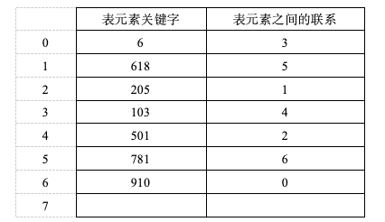  
  
A：单链表			B：双向链表  
C：单向循环链表	D：双向循环链表  
  
静态链表是使用一维数组实现的链表，在本题中，使用“表元素之间的联系”来反映各结点之间的关系，作用类似于链表中的next，数组中保存了7个值，线性表中的元素值是6个，表明数组下标0处保存的特殊结点，根据给出的表元素之间的关系，可以画出链表如下：  
  
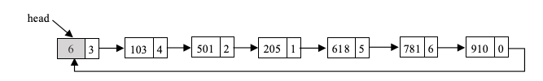  
根据链表图，链表为带有头结点的单向循环链表，头结点是下标为0的元素，链表中元素的个数是6  
  
  
二、填空题  
  
1、线性表是一个有限序列，组成线性表的是n(≥0)个（同类型的数据元素）。  
  
2、不带头结点的单链表L（head为头指针）为空的判定条件是（head == NULL）。  
不带头结点的空单链表中一个结点都没有，头指针的值为NULL  
  
3、带头结点的双向循环链表L（head为头指针）为空的条件是（head->next==head 或是 head->prev==head）  
带头结点的空双向循环链表中仅有一个头结点，且这个结点的next指针和prev指针都指向结点本身，即与head指向相同  
  
4、在带头结点的单链表中，当删除某一指定结点时，必须找到该结点的（前驱）。  
被删除结点的后继结点，变为被删除结点原前驱结点的后继结点，所以必须要找到前驱结点，并修改它的next值  
  
5、在数组中保存的链表称为（静态链表）。  
  
6、设一个非空的静态链表保存在数组中，以-1表示表尾所在结点为表尾结点，则含-1的单元个数最多为（1）2  
  
7、若线性表中每个元素占size个单元，采用顺序存储方式，第一个元素的存储位置是1000，  
则线性表第i个元素的存储位置Loc(aᵢ) = 1000 + (i-1)×size  
  
三、解答题  
  
1、在单链表中设置头结点的作用是什么？  
  
在单链表中进行插入和删除操作时，都要找到操作位置结点的前驱结点，但根据线性表当前指针的原始定义，前驱结点是不能通过  
当前指针直接找到的。所以，修改当前指针指向的结点，让其前移一个位置，即指向操作位置的前驱结点。这样修改后，通过当前  
指针很容易访问到插入和删除操作所涉及的各个结点，但当操作位置是第一个结点时，或是单链表是空表时，当前指针的指向又成  
为特殊情况，需要单独处理。为了能统一处理各种情况，给单链表添加一个虚拟结点，即头结点，从而减少实现插入和删除操作时  
对特殊情况的判定及处理情况。  
  
2、什么是单链表中的头结点，第一个数据结点和头指针？  
  
单链表中保存线性表中各数据的结点是数据结点，这些结点中第一个是第一个数据结点。它的前面是一个虚拟结点，称为头结点。  
一个特殊的指向单链表中最前面结点的指针是头指针，如果单链表中一个结点都没有，则头指针为空  
  
3、假设线性表L=（51,40,19,15,24,36），使用线性表ADT中定义的方法，列出删除19时对应的语句序列。  
  
if(isEmpty(&L)==FALSE){           // ① 先判断线性表是否为空  
    int pos,x;  
    pos = find(&L, 19);           // ② 查找元素19的位置  
    if(pos >= 0)                  // ③ 若找到了（下标非负）  
        removeList(&L, pos, &x);  // ④ 删除该位置元素  
}  
  
4、已知线性表中一个元素占8个字节，一个指针占2个字节，数组的大小为20个元素，在顺序及链式两种存储方式中，线性表应该采用哪种方式保存呢？为什么？  
  
n：表示线性表中当前元素的个数  
D：表示最多可以在数组中存储的元素个数，也就是数组的大小  
P：表示指针的存储单元大小  
E：表示数据元素的存储单元大小  
  
顺序存储占用的空间：D × E = 8 × 20 = 160  
链式存储占用的空间：（E+ P）× n = （8+2）× 20  = 200   
  
令：D × E = n × (P + E) 求出n的临界值：n = D × E/(P + E)   
  
n = D × E/(P + E)    
n = 160/(8+2)  
n = 160/10  
n =16  
  
临界值n=16，所以：  
如果线性表中元素个数 大于 n(临界值)，顺序表的空间存储效率更高，应该选择顺序存储方式来保存   
如果线性表中元素个数等于n(临界值)，则两种方式保存的空间存储效率一样，选择哪一种都可以  
如果线性表中元素个数 小于n（临界值），单链表的空间存储效率更高，应该选择链式存储方式来保存  
  
5、在单链表和双向链表中，从当前结点出发，能否访问到表中的任何一个结点？  
  
在单链表和双向链表中，如果从头结点或第一个数据结点出发，能访问到表中的任何一个结点  
但是从其他结点出发，都只能访问到该结点及其全部的后继结点，它的前驱结点是访问不到的  
  
6、若线性表（a₀,a₁,…,aₙ₋₁）采用顺序存储方式，那么aᵢ和aᵢ₊₁（0<=i<=n-1）的物理位置相邻吗？若采用链式存储方式，那么结果如何  
  
采用顺序存储方式存储时，aᵢ和aᵢ₊₁（0<=i<=n-1）的物理位置是相邻的，  
采用链式存储方式存储时，aᵢ和aᵢ₊₁（0<=i<=n-1）的物理位置不一定相邻，可能相邻也可能不相邻  
  
7、试分析双向链表中插入、删除、查找等基本操作的时间复杂度  
  
在双向链表中进行插入和删除操作时，如果给定了当前指针，则插入操作和删除操作的时间复杂度均为O(1)，因为操作过程中不需要进行元素的移动，也不需要将当前指针从表头后移到当前位置。  
查找操作的时间复杂度是根据查找目标在链表中的位置而定的。若在双向链表中一定能找到查找目标，则最优情况下，比较1次就能找到，时间复杂度为O(1)。最坏的情况下，需要进行n次比较，时间复杂度为O(n)。平均来看，需要查找约一半的链表，所以时间复杂度是O(n)。  
  
8、静态链表中，如何同时保存单链表及空闲空间链表  
  
静态链表采用的一片连续区域（数组）作为链表的存储空间。为有效使用存储空间，提高空间的使用效率，对于数组中所有未曾使用过的单元必定是保持一片连续单元，这样可以使用整型变量unused记录这片连续单元的首位置，凡是下标大于等于unused且不越界的单元，均为空闲单元。  
对于数组中曾经使用过且目前空闲的所有单元，建立一个静态的空闲单元链表将其链接起来，用整型变量available记录这个链表首结点的下标。  
  
9、静态链表中，unused的作用是什么？  
  
数组中所有未曾使用过的单元必定是一片连续单元，使用整型变量unused记录这篇连续单元的首位置，凡是大于等于unused且不越界的单元，均为空闲单元。  
  
所以unused的作用就是记录空闲单元的首位置  
  
四、算法阅读题  
  
1、在如图2-13b所示的带头结点的非空单向循环链表中保存了若干整数。算法avarage可求出这些整数的平均值。请在空白处填上适当内容以将算法补充完整  
  
对于（1），根据后面输出的内容可知，这里需要补上判定空表的条件。带头结点的空循环链表只含有一个头结点，且该结点的next域指向结点本身。  
对于（2），根据题意，循环体中要对表中的全部结点进行处理。进入循环之前，指针p指向了第一个数据结点。while循环的结束条件是什么呢？当指针p转回到表头时，表明已经处理完全部的数据结点，此时循环可以结束。也就是在p没有指向头结点时，循环不结束。当p==head时表明p指向头结点，当p!=head时表明p没有指向头结点。  
对于（3），返回的是表中元素的平均值。while循环体中已经计算了全部元素的和及元素个数，两个值做除法就可以了。注意不要进行整除，两个整数相除，结果可能除不尽，是个实型值。  
  
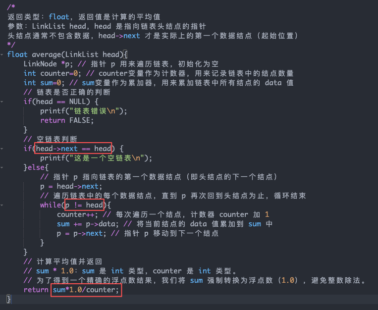  
  
2、单链表的结点及链表定义如下：  
  
typedef struct node{  
    int data; // 数据域  
    struct node *next; //指针域  
}LinkNode;  
typedef LinkNode *LinkList; //单链表  
  
算法largest可找出这些整数中的最大值。请在空白处填上适当内容以将算法补充完整  
  
对于（1），空单链表中仅含有一个头结点，头指针指向结点的next域为NULL。  
根据题意，要记录表中元素的最大值，这由if语句来完成。显然，if的条件是筛选最大值，后面的语句是将最大值保存下来。return语句中返回的是maxitem的值，意味着这个变量是用来保存最大值的，所以（3）的内容很容易写下来，就是将当前结点中的值赋给maxitem。那么，当前结点需要满足什么条件呢？是要大于原来保存的maxitem值，这是（2）要填写的内容。  
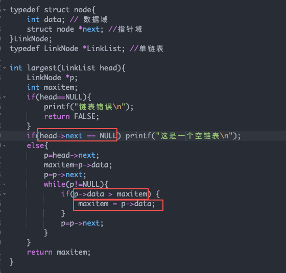  
  
3、阅读程序，并回答下列问题  
  
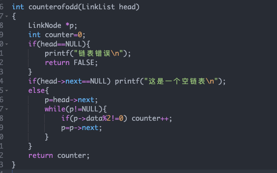  
（1）、若单链表head中保存的是（1,3,5,7,10），执行counterofodd(head)后，返回的结果是（4）  
  
（2）、counterofodd（）的功能是什么？  
统计单链表head中保存的奇数的个数  
  
五、算法设计题  
  
1、表2-1给出一个线性表操作示例，请采用顺序存储方式保存线性表，编程使用基本操作验证表中的结论  
  
  
